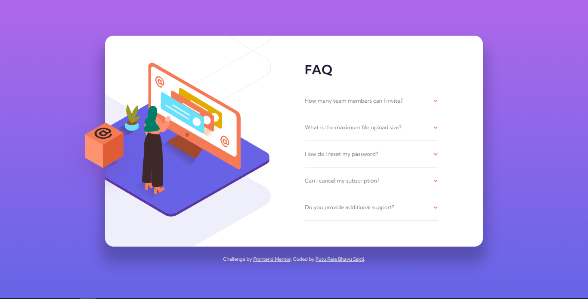
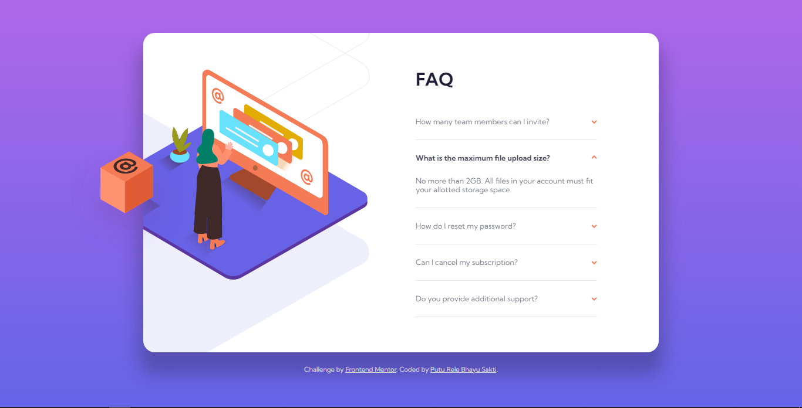
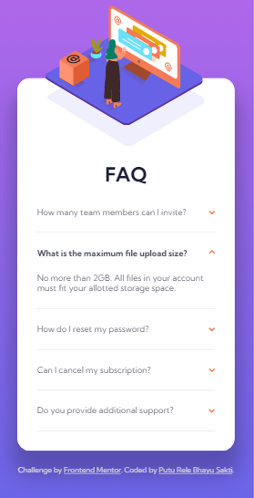

# Frontend Mentor - FAQ accordion card solution

This is a solution to the [FAQ accordion card challenge on Frontend Mentor](https://www.frontendmentor.io/challenges/faq-accordion-card-XlyjD0Oam). Frontend Mentor challenges help you improve your coding skills by building realistic projects.

## Table of contents

- [Overview](#overview)
  - [The challenge](#the-challenge)
  - [Screenshot](#screenshot)
  - [Links](#links)
- [My process](#my-process)
  - [Built with](#built-with)
  - [What I learned](#what-i-learned)
  - [Continued development](#continued-development)
  - [Useful resources](#useful-resources)
- [Author](#author)

## Overview

### The challenge

Users should be able to:

- View the optimal layout for the component depending on their device's screen size
- See hover states for all interactive elements on the page
- Hide/Show the answer to a question when the question is clicked
- Bonus: Complete the challenge without using JavaScript

### Screenshot

### Links

- Solution URL: [Solution URL here](https://www.frontendmentor.io/solutions/faq-accordion-card-with-css-grid-flexbox-and-no-javascript-fKyD52bkD6)
- Live Site URL: [Live site URL here](https://lere22.github.io/faq-accordion-card-chall/)

## My process

### Built with

- Semantic HTML5 markup
- CSS custom properties
- Flexbox
- CSS Grid
- CSS Only
- No Javascript

### What I learned

What i learned from creating the project FAQ accordion card is how to use srcset while controling the image for desktop preview and mobile preview, also I'm still trying to understand how to use position in CSS the correct way, so this is a good challenge for me.

### Continued development

I want to continue this project to collaborate with my other projects in the future.

### Useful resources

- [Fonts](https://fonts.google.com/) - This helped me for choosing the font what i want.
- [Frontend Mentor Resource](https://www.frontendmentor.io/resources) - This is an amazing resource which helped me to working on frontend project.
- [CSS Gradient](https://cssgradient.io/) - This is an amazing tool to create gradient color for designing an app.
- [W3 Schools](https://www.w3schools.com/) - This helped me for understanding the syntax of some programming language.

## Author

- Code by - Putu Rele Bhayu Sakti
- Frontend Mentor - [@lere22](https://www.frontendmentor.io/profile/lere22)
